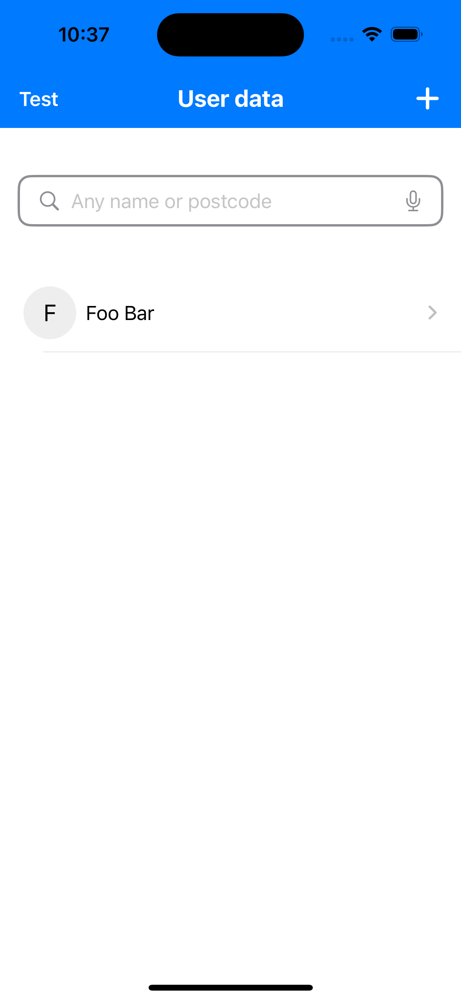
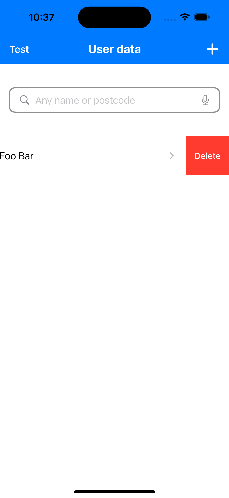
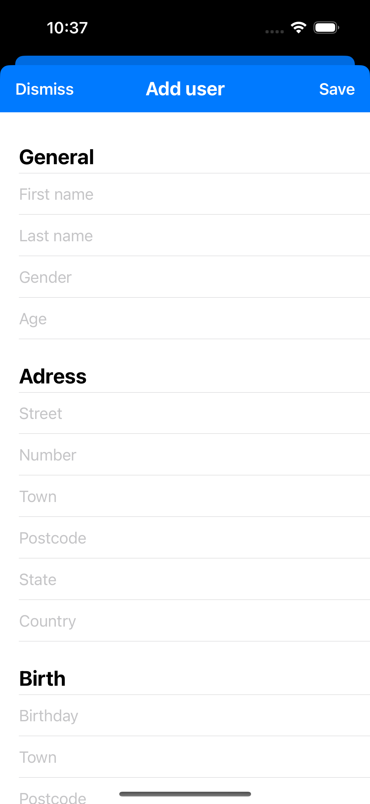
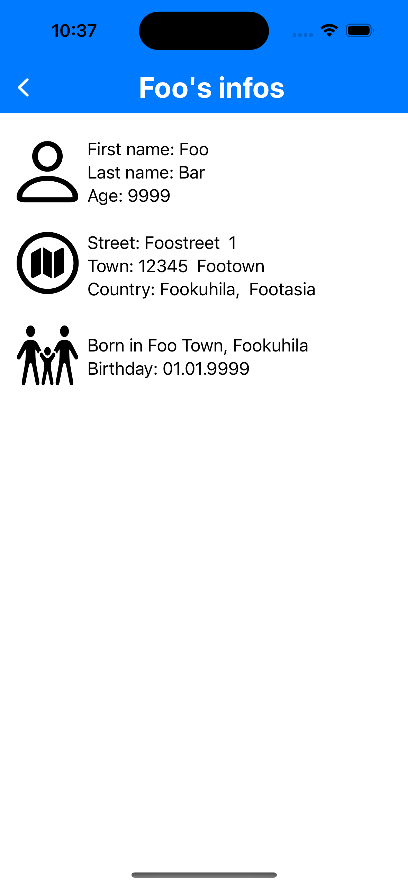

# UserDataFiltering
Fast implementation of a mini app that filters users by name or postcode.

## Goal of this project
Implementation of a mini app or user data view component to provide a solution for known difficulties
- a project using MVVM-architecture, Observable-pattern, dependencies and backend manager
- a custom toolbar to provide a customizable view for background and titles font and style
- a custom textfield as a searchfield with symbols and functionality
- a simple list with plain style, onDelete drag and navigation to other views

## Usings
SwiftUI, Swift-Collections, Apples SpeechRecognizer

## Screenshots
   
